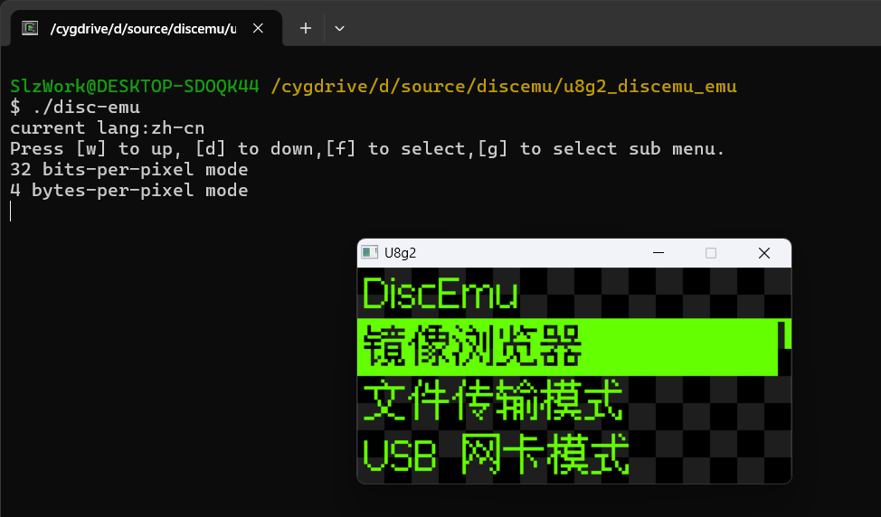
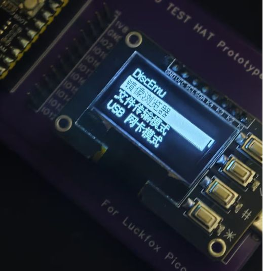

# DiscEmu
CD-ROM Emulator Device Software based on [driver1998's](github.com/driver1998/DiscEmu).This project has undergone a certain amount of refactoring and code modification compared to the original project.

Currently under continuous development.

## Improvement and enhancement
* Add Luckfox Pico Mini Support
* Add Keypad and I2C OLED Support
* Add SDL interface simulator
* Supports changing screen orientation
* Read-only mode
* Multilingual support (Current Support Simplified Chinese)

## TO-DO Lists
* Use U8g2 to replace with libu8g2arm fully. (Currently, only the SDL simulator uses U8g2.)
* Add practical simulation functionality to the source project.
* USB Floppy simulation.
* Original DiscEmu with SPI OLED and Encoder Support.(Use Milk-V Duo)
* Microcontroller support (e.g., CH32)

## Build 

### SDL interface simulator

This app depends on:
- [U8g2](https://github.com/olikraus/u8g2)
- [boost](https://sourceforge.net/projects/boost/files/boost/)
- [SDL2](https://github.com/libsdl-org/SDL/releases/tag/release-2.32.10)

Change makefile with the new TOOLCHAIN_PREFIX,U8G2_PREFIX and BOOST_PREFIX, and use ``make`` to compile program.

### Luckfox and Other
This app depends on the [libu8g2arm](https://github.com/antiprism/libu8g2arm) library and [boost](https://sourceforge.net/projects/boost/files/boost/) library.

Change makefile with the new TOOLCHAIN_PREFIX,U8G2_PREFIX and BOOST_PREFIX, and use ``make DEVICE_TYPE=luckfox USB_ON=1`` to compile program.

If you need to disable USB because need to debug, use ``make DEVICE_TYPE=luckfox USB_ON=0`` to compile program.

## Running Image

### SDL interface simulator

### Luckfox
